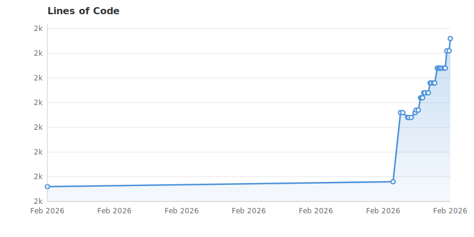

# ghloc — GitHub Lines of Code




A GitHub App that automatically counts lines of code in your repositories and provides LOC badges and history charts.

## Features

- **LOC counting** — Uses [scc](https://github.com/boyter/scc) for fast, accurate line counting
- **Shields.io badge** — JSON endpoint compatible with shields.io custom badges
- **SVG badge** — Self-hosted SVG badge rendered with go-badge
- **LOC history chart** — Star-history-style line chart showing LOC over time
- **Auto-commit** — Optionally commits badge and chart SVGs to your repo

## Endpoints

| Endpoint | Description |
|---|---|
| `GET /badge/{owner}/{repo}` | shields.io-compatible JSON |
| `GET /badge/{owner}/{repo}/svg` | SVG badge image |
| `GET /chart/{owner}/{repo}` | LOC history chart (SVG) |
| `POST /webhook` | GitHub webhook receiver |
| `GET /health` | Health check |

## Setup

### 1. Create a GitHub App

1. Go to **Settings > Developer settings > GitHub Apps > New GitHub App**
2. Set the webhook URL to `https://your-domain.com/webhook`
3. Generate a webhook secret
4. Set permissions:
   - **Repository contents**: Read & Write
   - **Metadata**: Read-only
5. Subscribe to events: **Push**, **Installation**
6. Generate and download a private key

### 2. Configure

```bash
cp .env.example .env
# Edit .env with your GitHub App credentials
```

### 3. Run

```bash
# Build and run
go build -o ghloc .
./ghloc

# Or with Docker
docker build -t ghloc .
docker run -p 8080:8080 \
  -v $(pwd)/private-key.pem:/app/private-key.pem:ro \
  -v $(pwd)/ghloc.db:/app/ghloc.db \
  -e GITHUB_APP_ID=123456 \
  -e GITHUB_PRIVATE_KEY_PATH=/app/private-key.pem \
  -e GITHUB_WEBHOOK_SECRET=secret \
  ghloc
```

### 4. Local development

Use the GitHub CLI to forward webhooks locally:

```bash
gh webhook forward --repo=owner/repo --events=push --url=http://localhost:8080/webhook --secret=your-secret
```

## Badge Usage

### shields.io endpoint

```markdown

```

### Self-hosted SVG

```markdown

```

### Committed badge

If `COMMIT_ARTIFACTS=true`, a badge is committed to `.ghloc/badge.svg` in your repo:

```markdown

```

## LOC History Chart

```markdown

```

## Quick Install (copy-paste for AI agents)

If you're using an AI coding agent, paste this prompt to add LOC tracking to your repo:

```
Add a lines-of-code badge and history chart to this repo's README using the
ghloc GitHub App (https://github.com/rjwalters/ghloc).

Steps:
1. Add these two lines near the top of README.md (after the title):

   
   

2. Commit and push the change.

The ghloc app is already installed on this account. On the next push it will
automatically count LOC and commit badge.svg and chart.svg to the .ghloc/
directory. The images won't render until the first webhook fires, which happens
on the push you just made.
```

If the app is not yet installed on your account, install it first at:
https://github.com/apps/lines-of-code-counter

## Privacy & Self-Hosting

When you install this GitHub App, it receives **read access to your repository contents** in order to count lines of code. The app performs a shallow clone, counts LOC, and immediately deletes the clone. No source code is stored or transmitted beyond the LOC statistics saved to the app's database.

That said, you are trusting the app operator with access to your code. If that's a concern — especially for private repositories — you can run your own instance:

1. **Fork this repo**
2. **Register your own GitHub App** (see [Setup](#setup) above)
3. **Deploy it yourself** — only your server ever sees your code

This is a small, self-contained Go binary with no external dependencies beyond Git and SQLite, so it's straightforward to host anywhere.

## Architecture

```
Push webhook → verify signature → get installation token
  → shallow clone → scc count → save snapshot to SQLite
  → update badge + optionally commit badge/chart to repo
```

## License

MIT
